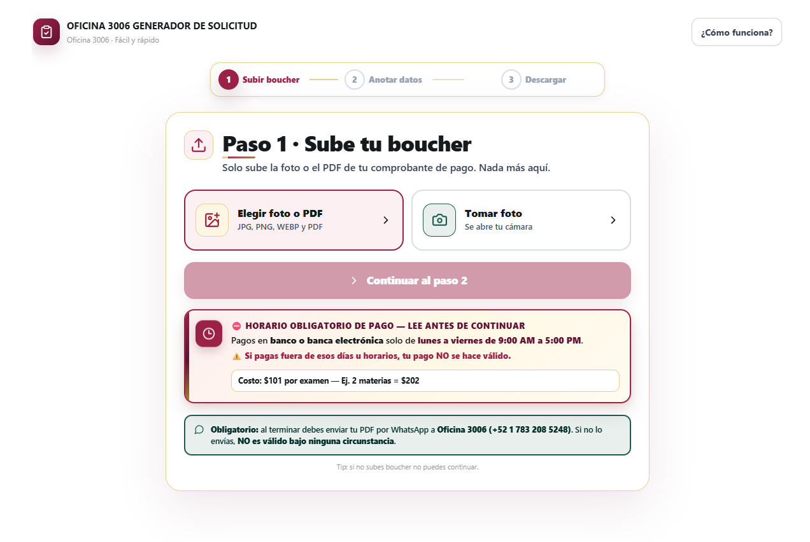
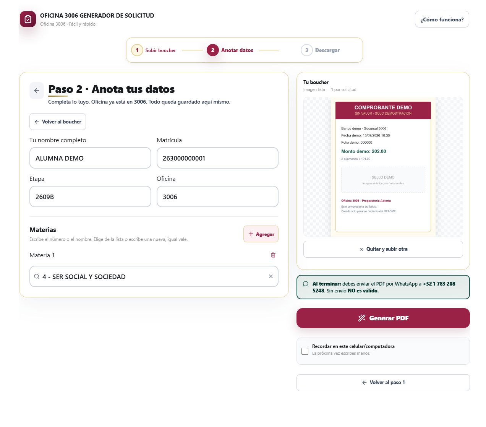
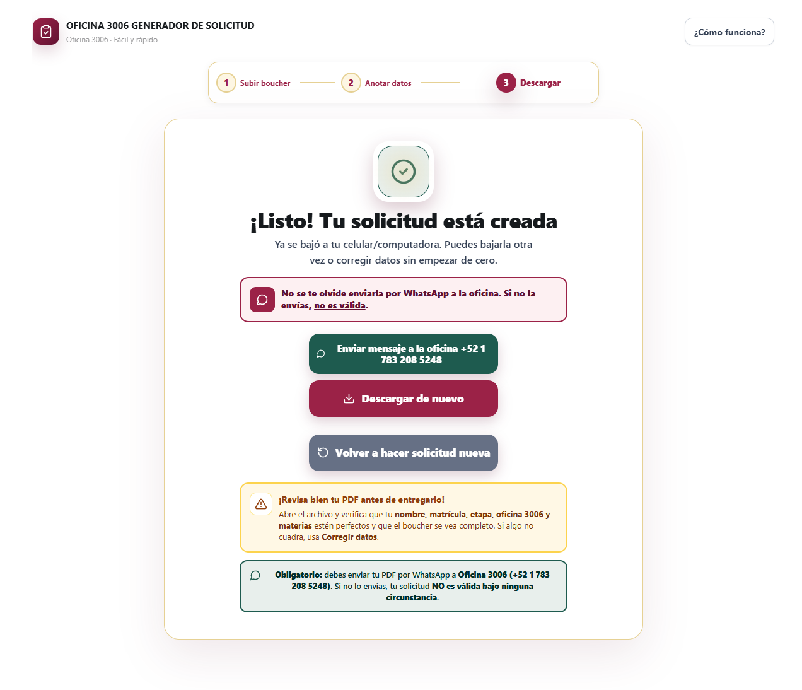
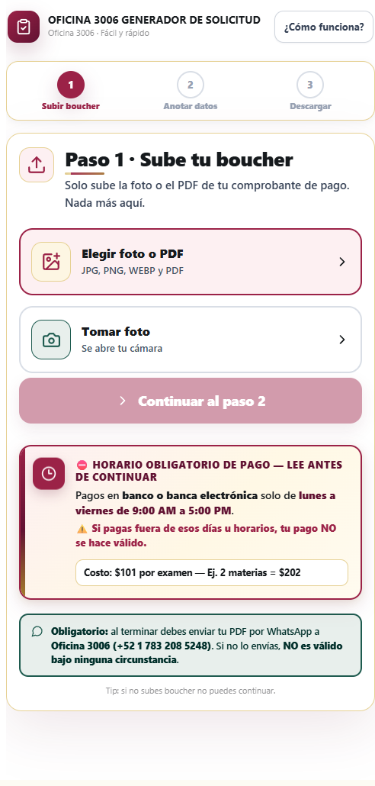

# Convertidor de comprobantes CEPA

PWA instalable y **100 % offline** para convertir un comprobante de pago en una
solicitud de examen. El procesamiento ocurre en el navegador: no requiere
backend, no sube fotografías y no envía datos automáticamente a terceros.

## Funcionalidades

- Carga de un comprobante en JPG, PNG, WEBP o PDF.
- Vista previa, validación de formato, detección de archivos HEIC y límite de
  12 MB para mantener el flujo usable en teléfonos.
- Captura de nombre, matrícula, etapa, oficina y una o más materias.
- Catálogo de materias con búsqueda tolerante a mayúsculas y acentos.
- Generación de PDF con `pdf-lib`, paginación y comprobante sin cubrir el texto.
- Almacenamiento local opcional de datos básicos mediante IndexedDB.
- Instalación como PWA en Android, iOS y navegadores de escritorio.
- Interfaz accesible: objetivos táctiles amplios, foco visible y respeto por
  `prefers-reduced-motion`.

## Capturas de pantalla

Flujo completo en tres pasos, capturado en la app real (escritorio 1280×800
y móvil 390×844):

### 1. Sube tu comprobante (escritorio)



### 2. Anota tus datos (escritorio)



### 3. Descarga y envía (escritorio)



### 1. Sube tu comprobante (móvil)



> **Datos ficticios:** todas las capturas usan datos sintéticos de
> demostración (`ALUMNA DEMO`, matrícula `263000000001`, etapa `2609B`) y el
> comprobante visible es `docs/demo-voucher.png`, una imagen generada solo
> para la documentación, marcada como **COMPROBANTE DEMO — SIN VALOR**. No
> contiene datos de ninguna persona real.

## Uso (3 pasos)

1. **Sube tu comprobante:** foto (JPG, PNG, WEBP) o PDF de tu pago, máximo
   12 MB. Sin comprobante no se puede continuar. Si tu foto es HEIC de
   iPhone, cambia a «Más compatible» en Ajustes > Cámara y vuelve a tomarla.
2. **Anota tus datos:** nombre completo, matrícula (8 a 16 dígitos), etapa
   (ej. `2609B`) y materias (escribe el número o el nombre y elige de la
   lista). La oficina ya viene con `3006`.
3. **Descarga y envía:** la app genera el PDF y lo descarga. **Obligatorio:**
   envíalo por WhatsApp a Oficina 3006 (+52 1 783 208 5248); sin ese envío
   la solicitud **no es válida**.

Costo de referencia: **$101 por examen** (ej. 2 materias = $202). Pagos en
banco o banca electrónica solo de **lunes a viernes, 9:00 AM a 5:00 PM**;
fuera de ese horario el pago no se hace válido. Verifica siempre los
requisitos vigentes con la oficina antes de pagar.

## Privacidad

Los archivos seleccionados se procesan en el dispositivo y no se envían a un
servidor desde esta aplicación. Si se activa la opción de recordar datos, solo
se guardan localmente `nombre`, `matrícula`, `etapa` y `oficina`; la opción está
desactivada por defecto y puede eliminarse desde la aplicación o el navegador.

Esta aplicación genera un documento; la persona usuaria debe verificar los
datos, requisitos, costos, horarios y canales de entrega vigentes antes de
utilizar la solicitud. El repositorio no sustituye las instrucciones oficiales
de la institución correspondiente.

## Requisitos

- Node.js 20 o posterior.
- npm 10 o posterior.
- Un navegador moderno con soporte para IndexedDB y Service Workers para usar
  las capacidades PWA.

## Instalación y desarrollo

```bash
git clone https://github.com/EmyFox/convertidor-comprobantes-cepa.git
cd convertidor-comprobantes-cepa
npm ci
npm run dev
```

Vite mostrará la dirección local en la terminal, normalmente
`http://localhost:5173`.

## Comandos

| Comando | Uso |
| --- | --- |
| `npm ci` | Instala las dependencias desde `package-lock.json`. |
| `npm run dev` | Inicia el servidor de desarrollo de Vite. |
| `npm run build` | Genera la versión de producción en `dist/`. |
| `npm run preview` | Sirve localmente la compilación de producción. |

Antes de desplegar, ejecuta `npm run build` y prueba la carga de imágenes, la
generación del PDF y la instalación PWA en el navegador objetivo.

## Despliegue

El proyecto incluye configuración para Netlify en `netlify.toml`:

1. Importa este repositorio en Netlify.
2. Usa `npm run build` como comando de compilación.
3. Usa `dist` como directorio de publicación.

También puedes publicar manualmente el contenido generado en `dist/` en
cualquier hosting estático que soporte HTTPS. HTTPS es necesario para que los
Service Workers funcionen fuera de `localhost`.

## Estructura

```text
src/
  App.jsx                       Flujo principal de captura y generación.
  main.jsx                      Punto de entrada de React.
  styles.css                    Estilos, accesibilidad y responsive.
  components/
    Confidence.jsx              Indicador visual de validación.
    Progress.jsx                 Progreso del flujo.
    PWAInstall.jsx               Instalación en Android y guía para iOS.
  lib/
    known.js                    Catálogo de materias.
    pdf.js                      Construcción del PDF.
    storage.js                   Persistencia local con idb-keyval.
    validation.js                Validaciones con Zod.
public/                          Iconos y recursos estáticos de la PWA.
```

## Contribuciones

Las mejoras son bienvenidas mediante issues y pull requests. No incluyas
credenciales, archivos `.env`, fotografías de comprobantes, documentos con
datos personales, `node_modules`, `dist` ni logs. Revisa `.gitignore` antes de
crear un commit.

## Licencia

Este proyecto se distribuye bajo la licencia MIT. Consulta [LICENSE](LICENSE)
para conocer los permisos y las condiciones completas.
